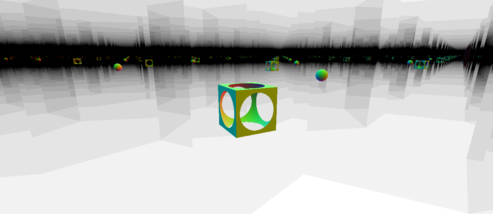
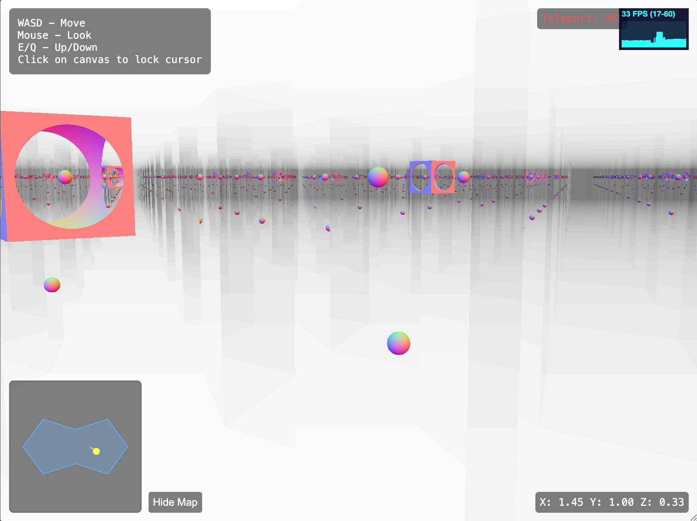

# RayMarchingFlatSurfaces

An interactive visual exploration of ray marching techniques applied to various geometric surfaces, including translation surfaces, mirror rooms, and cube surfaces.



## Overview

This project implements ray marching algorithms using WebGL shaders to render different mathematical surfaces and geometric spaces in real-time. By leveraging the power of fragment shaders, the application visualizes complex mathematical structures with high performance while maintaining interactive frame rates.

### Key Features

- **Multiple Geometry Types**: Explore diverse mathematical surfaces including translation surfaces, mirror rooms, L-shapes, and more
- **Interactive Camera**: Navigate through the generated spaces with intuitive mouse and keyboard controls
- **Real-time Visualization**: Experience smooth, high-performance rendering of complex geometries
- **Teleportation System**: Camera seamlessly follows the underlying surface geometry
- **Floor Plan View**: Track your position with an interactive overhead map
- **Responsive Design**: Adjustable resolution settings for optimal performance across devices



## Getting Started

### Prerequisites

- Node.js (for building the project)
- A modern web browser with WebGL support
- **Note**: This project has only been tested on Firefox and Chrome browsers

### Installation

1. Clone this repository:
```bash
git clone https://github.com/FabianLander/RayMarchingFlatSurfaces.git
```

2. Navigate to the project directory:
```bash
cd RayMarchingFlatSurfaces
```

3. Install dependencies:
```bash
npm install
```

4. Start the development server:
```bash
npm run dev
```

The application will open automatically in your default browser.

## Building for Production

To create a production build:

```bash
npm run build
```

The built files will be in the `dist` directory and can be deployed to any static web server.

To preview the production build locally:

```bash
npm run preview
```

## How It Works

<!--  -->

The application implements ray marching techniques through optimized fragment shaders to render complex geometries:

1. **Ray Casting**: For each pixel, the algorithm casts a ray originating from the camera into the scene
2. **Distance Calculation**: The shader efficiently computes the minimum distance to any surface in the scene
3. **Marching**: The algorithm advances along the ray by the calculated safe distance
4. **Iteration**: Steps 2 and 3 repeat until either a surface is hit or the maximum step count is reached
5. **Shading**: Upon hitting a surface, the shader calculates lighting, reflections, and material properties

For flat surfaces and translation/mirror spaces, this technique provides both accurate visualization and excellent performance compared to traditional rasterization methods.

## Controls

- **WASD**: Move the camera forward, left, backward, and right
- **Q/E**: Move the camera up/down
- **Mouse**: Look around
- **Teleport Toggle**: Enable/disable teleportation between connected spaces

## Implemented Geometries

- **Double Pentagon (Mirror)**: Pentagon surface with mirror reflections
- **Double Pentagon (Translation)**: Pentagon surface with translation mapping
- **L-shape**: L-shaped domain with different boundary conditions
- **Cube**: surface of a cube times a Euclidean height component
...


## Adding New Geometries

To add a new geometry:

1. Create a new fragment shader in the `shader/` directory
2. Define the distance function and boundary conditions
3. Add the geometry information to the `geometries/manifest.json` file

## Future Improvements

- [ ] Additional surface types (hexagon, octagon, etc.)
- [ ] Dynamic lighting conditions
- [ ] Enhanced boundary visualizations
- [ ] Performance optimizations for complex geometries
- [ ] Mobile touch controls support

## Bugs

- [ ] Currently matrices in the affine case (see cube for example) are not the ones one would expect. The linear parts are somehow inverted. This will likely be fixed if we stop projecting the geomeries in the xz plane but instead in the xy plane which is more natural.

## Contributing

Contributions are welcome! Please feel free to submit a Pull Request.

## License

This project is licensed under the MIT License - see the [LICENSE](LICENSE) file for details.

## Acknowledgments

This project is a refactored and improved version of the original work at [HEGL Lab](https://github.com/hegl-lab/Independent-SS22-Raymarching-Flat-Surfaces).

Original contributors:
- Fabian Lander
- Mara-Eliana Popescu
- Diaaeldin Taha

Current maintainers:
- Fabian Lander